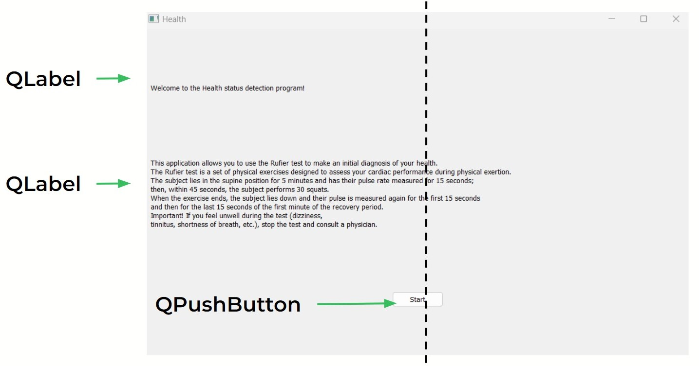
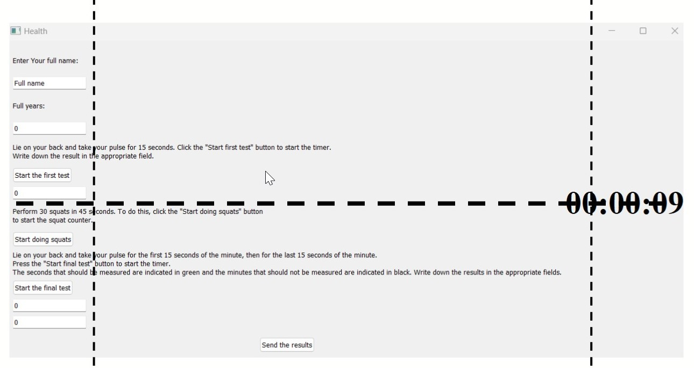
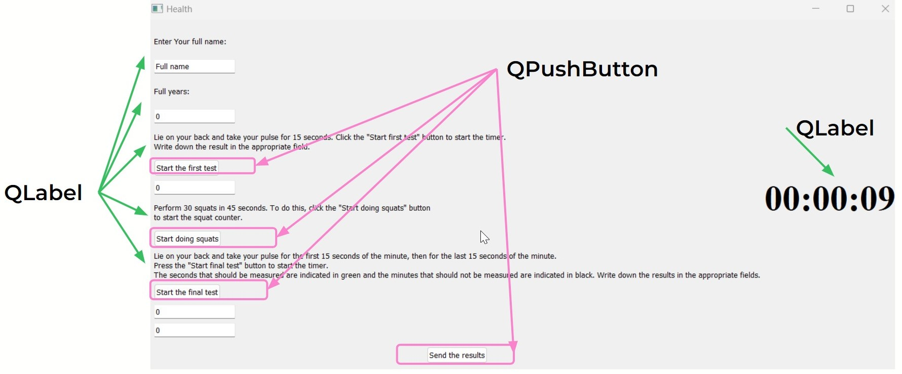
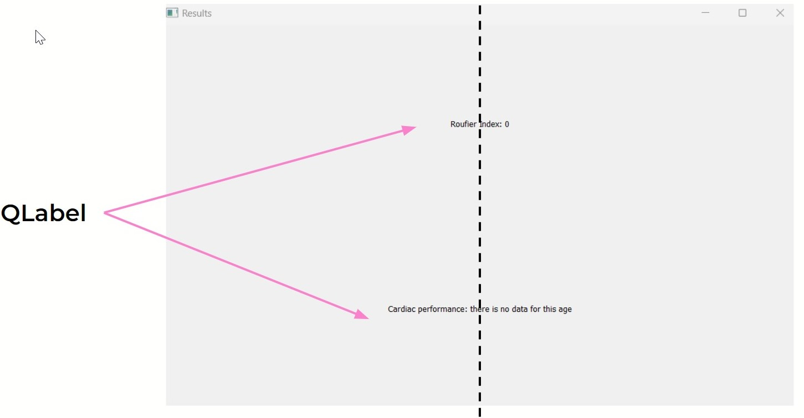
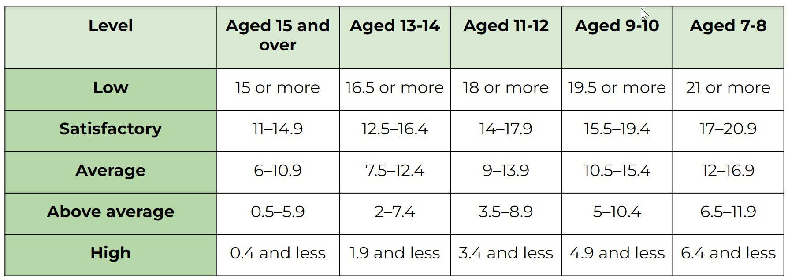

# Rouffier_Test
This application allows you to use the Rufier test to make an initial diagnosis of your health
The Rufier test is a set of physical exercises designed to assess your cardiac performance during physical exertion.
The subject lies in the supine position for 5 minutes and has their pulse rate measured for 15 seconds;
then, within 45 seconds, the subject performs 30 squats.
When the exercise ends, the subject lies down and their pulse is measured again for the first 15 seconds
and then for the last 15 seconds of the first minute of the recovery period.
Important! If you feel unwell during the test (dizziness, tinnitus, shortness of breath, etc.), 
stop the test and consult a physician.
## Screen 1

## Screen 2
  - #### Alignment
    
  - #### Label and Button
    
  - #### Line Edit
    
## Screen 3
  - #### Screen
      
  - #### Ruffier İndex
    ```math
    index = \frac{4(P1+P2+P3)-200}{10}
    ```
    P1, P2, and P3 are the results of pulse measurements.
  - #### Rufier Index Table
      The evaluation is correlated with age
      

